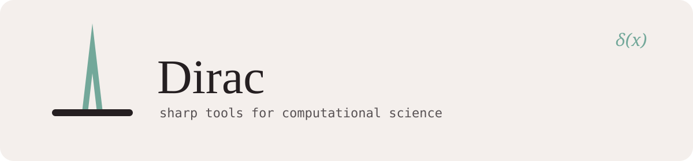

<picture>
  <source media="(prefers-color-scheme: dark)" srcset="assets/banner-dark.svg">
  
</picture>

  <b>simulation</b> &nbsp;·&nbsp; <b>data</b> &nbsp;·&nbsp; <b>visualization</b>

Small, sharp, well-tested. Most work lives in private repos.

